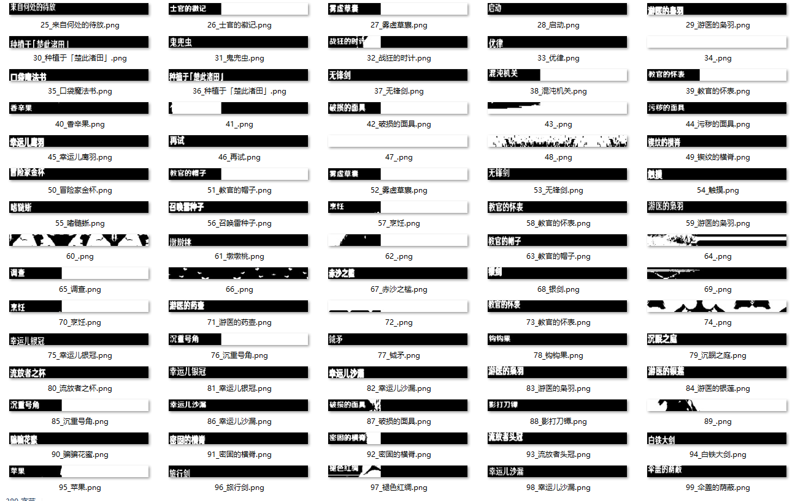

# Yap-Train
SVTR training from Yas-Train, and CenterNet training

## 介绍

基于yas-train二次开发的yap-train。主要的改动有：

## 增加了CenterNet的训练支持

CenterNet用于目标检测。yas-train仅训练SVTR用于不定长文字识别。

对于yap所需的F key 的检测，使用了基于CenterNet进行中心点及offset的回归的方法，
即抛弃了CenterNet的宽高回归，仅使用中心点及offset回归。并重新设计了输出输出的size，
输入`[64, 384]`，输出的heatmap`[16, 96, c+2]`。

目前使用纯生成数据进行训练。即从背景图中截取`[67, 380]`（yap的真实尺寸）的图像，然后在图像中通过掩码随机生成粘贴F key及其小三角，
最后resize到`[64, 384]`。并计算训练所需的heatmap及offset。

目前还未进onnx部署。

## mona.text，即词库的改动

| 脚本名字 | 内容 |
| -------- | -------- |
| [artifact_name.py](./mona/text/artifact_name.py) | 精英怪、调查点、宝箱可能掉落的圣遗物 | 
| [bwiki_spider.py](./mona/text/artifact_name.py) | 爬bwiki材料图鉴的，**已弃用**|
| [characters.py](./mona/text/characters.py) | 自给角色、常见（目前是手动添加）NPC、~~杂项（出现概率差不多的）~~ |
| [domains.py](./mona/text/domains.py) | 各种秘境、除了邀约/传说任务秘境 |
| [material.py](./mona/text/material.py) | 怪物掉落、直接采集、可采集的生物、宝箱掉落（除了武器及圣遗物，即经验书、武器矿、天赋书） |
| [operations.py](./mona/text/operations.py) | 大世界及尘歌壶里能遇到的互动按键 |
| [weapons.py](./mona/text/weapons.py) | 1-3星可调查掉落or宝箱掉落的武器 |

还有其他的词库，欢迎提交pr。

## 预处理改动

yap同样使用阈值化作为文字识别的预处理。对于这种绝大多数是双峰的像素分布，直接改为大津阈值了（说实话没看懂yas的阈值实现），但是灰度通道对白色并不敏感，后面需要换通道（瓶颈实际在rust中，并没有现成的转换通道实现）。

此外在resize和padded到模型输入大小时，使用了多种pad方式。

## 生成数据改动

yas生成的数据并不适用于yap自动拾取的场景。因为拾取场景

1. 字的大小几乎不变
2. 字符宽度（word中的字符缩放）与yas生成的不同
3. 笔画宽度会因为阈值而变化
4. 字的y方向会有偏移，x方向基本不会

改动
1. 减少了字体大小的变化
2. 使用长宽比来控制字的宽度
3. 通过指定渲染时的stroke-width来控制笔画宽度
4. 相比x方向，使y方向的偏移范围更大

**BTW，来猜一猜哪些是生成的哪些是真实的。**

此外，由于真实数据中由于阈值造成的噪声，见上图的87、92、97等图，生成数据时使用了一半的真实数据，另一半为生成数据，实现见[datagen.py](./mona/datagen/datagen.py)中的`generate_mix_image()`函数。

标注的真实数据有26590张，其中14260张为空白图。（整理完再放上来吧）

所以在padded到网络输入大小时，使用了多种pad方式，空白label的5钟，有字的2钟。实际的真实数据规模扩充到了` 14260*5 +(26590-14260)* 2` = `95960`。

但是由于生成数据相当接近阈值化干净的真实数据，故可以做到0 shot。这一点也在许多一次性秘境中得到验证。

## 人工标注

标注使用yap项目中的[标注脚本](https://github.com/Alex-Beng/Yap/blob/master/script/labeling.py)，使用opencv的waitkey交互，使用tesseract及yap的结果减少输入量。

键位建议直接看代码，非常简单，且左右手对称，便于平衡左右手输入量。

### 标注结果

前期使用pickle，现在改为json。具体处理可见yap项目中的`script/`

`x.json`： 相对`yap`目录的image路径数组

`y.json`：image的标签

# 环境配置

与[yas-train](https://github.com/wormtql/yas-train)一致。

# 训练

见[train.md](./train.md)